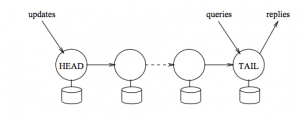

## 前言
分布式系统中，强一致性通常被认为和高可用、高吞吐不相容，为了实现系统的高可用、高吞吐必须要牺牲强一致性。比如在亚马逊的Dynamo提供最终的一致性，但是这样其实给开发者带来很多问题：

- 写入的数据在后续的读操作中不能被读取到
- 写入的数据有可能在后续的读操作中获取到，但是读到后下一次又读不到

Dynamo不保证一定能够读到写入的数据，将复杂的冲突合并工作留到了客户端；由于Dynamo的冲突合并过于复杂，再后来的系统Amazon S3使用‘Last-write wins’来解决冲突，但是仍然不能完全解决上面提到的问题。

Google的GFS在写成功时是一致的，写失败时是不一致的，因此GFS的Record Append提供的是至少成功写一次的语义，由客户端读的时候自己来解决一致性问题。

这样会带来一致性问题，比如：数据在某个chunk副本中重复出现了多次，但是在其他副本中可能没有。在记录级别上，读到的记录顺序依赖于刚好读取到哪个chunk副本。

而开发者更加希望能够提供强一致的保证，由分布式系统提供强一致的保证，这样可以提高开发效率。

在Chain Replication for Suppporting High Throughput and Availability这篇论文中作者提出强一致性，高吞吐性、高可用是相容的，并解释了具体实现方法。

## 链式复制

头结点包含所有的写操作，从头结点到尾节点所有包含的写操作越来越少（所有的操作需要从上一个节点传递下来），对写操作的确认在尾节点，读操作也在尾节点进行。

节点上的操作乡下一个节点同步是FIFO的，因此后续节点上的数据记录肯定是前面节点的前缀。

比如:
HEAD节点:(a=1)(b=2)(c=3)(d=4)
TAIL节点:(a=1)(b=2)

TAIL节点上的数据记录是HEAD节点、MIDDLE节点的前缀，MIDDLE节点上的记录是HEAD节点记录的前缀。

HEAD:(a=1)(b=2)(c=3)(d=4)
MIDDLE:(a=1)(b=2)(c=3)
TAIL:(a=1)(b=2)

头结点拥有四个写操作，其中a=1，b=2已经到达尾节点，由尾节点向客户端返回成功。

c=3，d=4这两条记录尾节点还未返回成功。

这时如果客户端的读发生在尾节点，因此只能读到(a=1, b=2)这两条记录，(c=3, d=4)这两条记录现在读不到。

在正常流程中强调一致性的保证是显而易见的，现在我们来分析异常宕机的情况：
- 头节点宕机
头节点宕机，记录d=4丢失，但是由于对d=4这条记录的确认没有返回给客户端，因此并不影响数据的一致性。

- 尾节点宕机
TAIL节点宕机后，TAIL节点的父节点接替它成为尾节点，由于它上面的记录总是比尾节点上的记录多，而且尾节点上的记录是它父节点记录的前缀。因此客户端看见的数据变多了，并没有对视数据，因此也是强一致的。

- 中间节点宕机
中间节点宕机后，并不影响读的一致性，由上图可知TAIL节点上的数据是HEAD节点数据的前缀，只要父节点将数据同步下来即可。

## 协议应用
在CRAQ论文中介绍了使用链式复制的CRAQ系统，该系统扩展了链式复制协议，使得读操作可以在每个节点上发生，提高系统的吞吐，同事仍然提供强一致性的保障。

Hibari是一个使用链式复制的开源Key-value数据库，文档非常完善，客户端支持java，C/C++，Python，Ruby，Erlang，而且已在数百万用户的电信系统中稳定运行。相比Riak，Hibari提供了强一致的保证，对开发者更加友好。

微软云计算平台Windows Azure、FDS都是使用了链式复制协议提供强一致性保证。而百度的新存储，从它的架构图中以及提供的一致性保证中，也可以推测使用了链式复制协议。

## 参考文章
- [分布式存储复制技术: 链式复制](http://ju.outofmemory.cn/entry/213202)
