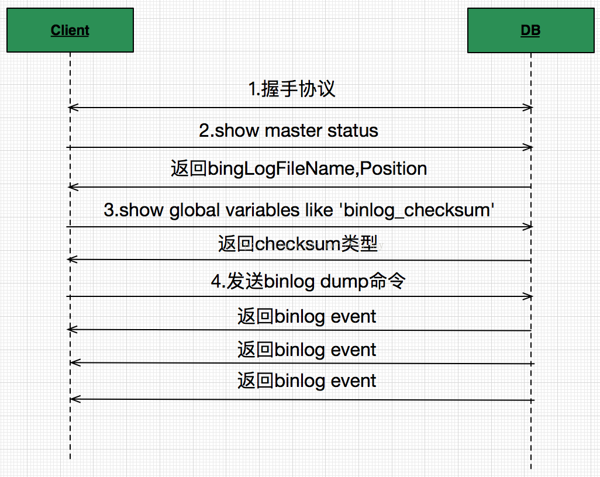

## 交互流程

Binlog发送接收流程如下图所示: 



- 通过HandShake协议进行Client和DB的握手认证
- 握手成功后，Client对DB发送show master status命令，该命令中带回当前最新binlog存储在哪个文件，以及对应哪个偏移量。如果想从当前开始接收binlog，则在后面发送binlog dump 命令的时候用这两个值就可以。
- 发送show global variables like 'binlog_checksum'命令，这是由于binlog event发送回来的时候，在最后获取event内容的时候，会增加4个额外字节做校验用。MySQL5.6.5之后的版本中binlog_checksum=crc32，而低版本都是binlog_checksum=none。如果不想校验，可以使用set命令设置set binlog_checksum=none。
- 最后发送Dump命令请求binlog

## MySQL IO线程

- 启动流程

首先，在备库执行change master函数，将主库的信息写入到备库中。

```
mysql_execute_command()
 |-check_global_access()          ← 查看用户是否有权限
 |-change_master_cmd()            ← 判断是否创建channel，调用如下函数
   |-change_master()              ← 命令的实际入口函数
```

在编译源码的时候，需要开启HAVE_REPLICATION的宏定义，在备库上执行start slave命令后，会在sql_parse.cc中执行SQLCOM_SLAVE_START分支，实际执行的是start_slave()函数。

```
mysql_execute_command()
 |-start_slave_cmd()
   |-start_slave()
     |-start_slave_threads()
       |-start_slave_thread()                ← 先启动IO线程，无误再启动SQL线程
       | |-handle_slave_io()                 ← IO线程处理函数
       |
       |-start_slave_thread()
         |-handle_slave_sql()                ← SQL线程处理函数
```

备库中有两类处理线程，也就对应了两个函数handle_slave_sql()和handle_salve_io()，分别用于从主库读取数据，以及将主库数据写入到备库。

- IO线程

## MySQL Dump线程


## 协议格式

- 连接建立

连接建立时，从库的handle_slave_io()线程调用safe_connect()来实现的。该函数主要使用MySQL通信API进行的连接。

```
MYSQL *mysql
mysql_options();
while(!(slave_was_killed = io_slave_killed(thd,mi))
	&& (reconnect ? mysql_reconnect(mysql) != 0 :
	mysql_real_connect(mysql, mi->host, user,
		password, 0, mi->port, 0, client_flag) == 0)) {
}
```

上面流程看出，在slave连接主库时，会不断的进行连接，直到连接上主库为止。连接上主库之后，便可以通过MYSQL句柄进行指令的交互了。

- 获取主库信息

```

```

- 从库向主库注册数据包

```
 1              [15] COM_REGISTER_SLAVE
 4              server-id
 1              slaves hostname length
 string[$len]   slaves hostname
 1              slaves user len
 string[$len]   slaves user
 1              slaves password len
 string[$len]   slaves password
 2              slaves mysql-port
 4              replication rank
 4              master-id
```

从库中handle_slave_io(void *arg)线程中，调用register_slave_on_master(mysql, mi, &suppress_warnings)函数组包，然后调用simple_command()函数发送给主库。

主库获取payload，构造SLAVE_INFO结构体，而后调用my_hash_insert(&slave_list, (uchar *si))函数进行注册。

- 


## 参考
[MySql-Binlog协议详解（流程篇）](http://blog.csdn.net/hj7jay/article/details/56665057)
[COM_BINLOG_DUMP_GTID 报文分析](http://blog.csdn.net/hittata/article/details/52290336)
[MySQL协议解析](http://www.cnblogs.com/davygeek/p/5647175.html)
[MySQL复制源码解析](https://jin-yang.github.io/post/mysql-replication-sourcecode.html)

