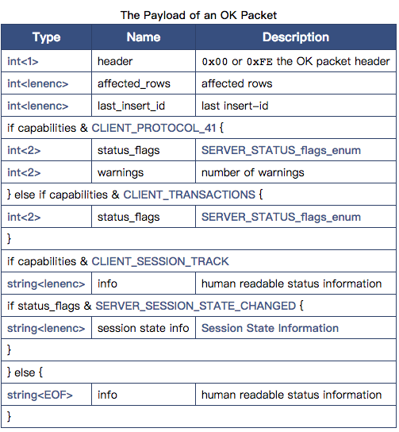

## 数据包格式

客户端与服务器端交互发送数据包时：
- 将数据分割成2^24字节的数据
- 每个数据添加数据包头

<table> 
	<tr>
		<td>Type</td>
		<td>Name</td>
		<td>Description</td>
	</tr>
	<tr>
		<td>int<3></td>
		<td>payload_length</td>
		<td>Length of the payload. The number of bytes in the packet beyond the initial 4 bytes that make up the packet header</td>
	</tr>
	<tr>
		<td>int<1></td>
		<td>sequence_id</td>
		<td>Sequence ID</td>
	</tr>
	<tr>
		<td>string<var></td>
		<td>payload</td>
		<td>payload of the packet</td>
	</tr>
</table>

## 发送大于16M的数据包

如果发送数据包大于或等于2^24 -1 字节，发送数据的长度应设置为2^24 -1 (ff ff ff)并且发送剩余的数据通过额外的数据包，直到载荷的长度小于2^24 -1 。

例如，发送载荷长度为16777215（2^24 - 1）字节，数据包如下：

```
ff ff ff 00 ...
00 00 00 01 ...
```

## Sequence ID

Sequence ID 随着每个数据包递增，从0开始，每个命令阶段重置为0

## 通用相应包

### OK_Packet

OK packet是从server端发送至client端的，用于标识一条命令的成功结束。在MySQL5.7.5中，OK packet也用于标识EOF，而EOF被弃用。

如果CLIENT_PROTOCOL_41被设置，数据包会包含warning count。



下述规则用以区分代表OK或是EOF：

- OK：header = 0 and length of packet > 7
- EOF： header = 0xfe and length of packet < 9

为了保证MySQL新（5.7.5及其后续版本）旧（5.7.5之前）版本的向后兼容，新版客户端会标识CLIENT_DEPRECATE_EOF flag。

- 旧版本的客户端并不知道该flag并且不会标识该flag。因此，server不会发送OK包来表示EOF。（旧版本的服务器不会这样做。新版本服务器意识到该flag没有被标识，所以不会这么做）。

- 新版本的客户端标识该flag。旧版本的服务器端不知道该flag，并且不会发送OK包来表示EOF包。新版服务端意识到该flag并且发送OK包来表示EOF。

## 举例

当带有CLIENT_PROTOCOL_41的OK包中，0 affected rows, last-insert-id 是0, AUTOCOMMIT 打开， 0 warnings， 没有任何info。

```
07 00 00 02 00 00 00 02 00 00 00
```


## 参考
- [MySQL Packets](https://dev.mysql.com/doc/dev/mysql-server/8.0.0/page_protocol_basic_packets.html)


