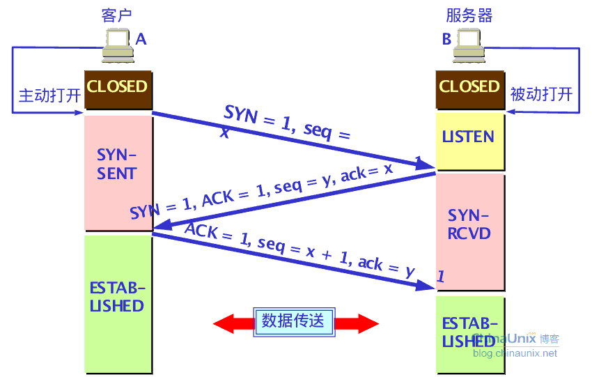
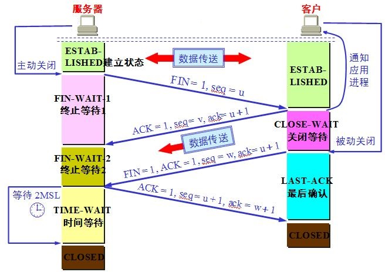

## TCP连接建立
- 三次握手图



- 数据抓包

```
13:52:53.305468 IP 10.5.233.200.45978 > 10.5.234.226.search-agent: Flags [S], seq 1301327529, win 14600, options [mss 1460,sackOK,TS val 3175272095 ecr 0,nop,wscale 7], length 0
13:52:53.305512 IP 10.5.234.226.search-agent > 10.5.233.200.45978: Flags [S.], seq 4214121876, ack 1301327530, win 14480, options [mss 1460,sackOK,TS val 3379828262 ecr 3175272095,nop,wscale 7], length 0
13:52:53.305933 IP 10.5.233.200.45978 > 10.5.234.226.search-agent: Flags [.], ack 4214121877, win 115, options [nop,nop,TS val 3175272095 ecr 3379828262], length 0
```

## TCP连接断开
- 四次挥手图



- 数据抓包

```
14:05:07.825766 IP 10.5.233.200.46341 > 10.5.234.226.search-agent: Flags [F.], seq 906838083, ack 813820492, win 115, options [nop,nop,TS val 3176006615 ecr 3380557982], length 0
14:05:07.825896 IP 10.5.234.226.search-agent > 10.5.233.200.46341: Flags [F.], seq 813820492, ack 906838084, win 114, options [nop,nop,TS val 3380562782 ecr 3176006615], length 0
14:05:07.826121 IP 10.5.233.200.46341 > 10.5.234.226.search-agent: Flags [.], ack 813820493, win 115, options [nop,nop,TS val 3176006615 ecr 3380562782], length 0
```

## 测试程序

- TCPServer

```
#include <stdio.h>
#include <string.h>
#include <sys/socket.h>
#include <netinet/in.h>
#include <stdlib.h>

int main(){

    struct sockaddr_in server;
    struct sockaddr_in client;
    int listenfd,connetfd;
    char ip[20];
    int port;
    int addrlen;
    char rebuf[100];
    char wrbuf[100];
    char tmp[100];
    int revlen;
    /*---------------------socket-------------------*/
    if((listenfd = socket(AF_INET,SOCK_STREAM,0))== -1){
        perror("socket() error\n");
        exit(1);
    }

    /*----------------------IO-----------------------*/
    printf("Please input the ip:\n");
    scanf("%s",ip);
    printf("Please input the port:\n");
    scanf("%d",&port);

    /*---------------------bind----------------------*/
    bzero(&server,sizeof(server));
    server.sin_family = AF_INET;
    server.sin_port = htons(port);
    server.sin_addr.s_addr = inet_addr(ip);
    if(bind(listenfd,(struct sockaddr *)&server,sizeof(server))== -1){
        perror("bind() error\n");
        exit(1);
    }

    /*----------------------listen-------------------*/
    if (listen(listenfd,5)== -1){
        perror("listen() error\n");
        exit(1);
    }

    /*----------------------accept------------------*/
    addrlen = sizeof(client);
    if((connetfd = accept(listenfd,(struct sockaddr *)&client,&addrlen))== -1){
        perror("accept() error\n");
        exit(1);
    }
    /*---------------------show client---------------*/
    printf("connect successful!\n");
    /*printf("the client ip is %s,port is %d\n",inet_ntoa(client.sin_addr),ntohs(port));*/

    /*----------------------read and write----------*/
    int serial = 0;
    while(1){
    bzero(rebuf,sizeof(rebuf));
    revlen = read(connetfd,rebuf,sizeof(rebuf));
    if((memcmp("bye",rebuf,3))== 0){
        printf("Bye-bye then close the connect...\n");
        break;
    }
    bzero(wrbuf,sizeof(wrbuf));
    bzero(tmp,sizeof(tmp));
    sprintf(tmp,"%d",serial);
    strcat(tmp,rebuf);
    bcopy(tmp,wrbuf,strlen(tmp));
    write(connetfd,wrbuf,sizeof(wrbuf));
    rebuf[revlen] = '\0';
    printf("the info from client is:%s\n",rebuf);
    serial++;
    }

    /*----------------------close-------------------*/
    close(connetfd);
    close(listenfd);

    return 0;
}
```

- TCPClient

```
#include <stdio.h>
#include <string.h>
#include <sys/socket.h>
#include <netinet/in.h>
#include <stdlib.h>

int main(){
    int sockfd;
    char wrbuf[100];
    char ip[20];
    int port;
    int revlen;
    char rebuf[100];
    struct sockaddr_in server;

    /*---------------------socket---------------------*/
    if((sockfd = socket(AF_INET,SOCK_STREAM,0))== -1){
        perror("socket error\n");
        exit(1);
    }

    /*---------------------connect--------------------*/
    printf("Please input the ip:\n");
    scanf("%s",ip);
    printf("Please input the port:\n");
    scanf("%d",&port);
    bzero(&server,sizeof(server));
    server.sin_family = AF_INET;
    server.sin_port = htons(port);
    inet_aton(ip,&server.sin_addr);
    if(connect(sockfd,(struct sockaddr *)&server,sizeof(server))== -1){
        perror("connect() error\n");
        exit(1);
    }

    /*-----------------------read and write------------------*/
    while(1){
    bzero(wrbuf,sizeof(wrbuf));
    bzero(rebuf,sizeof(rebuf));    
    printf("Please input the info:\n");
    scanf("%s",wrbuf);
    if((memcmp("bye",wrbuf,3))== 0){
        write(sockfd,wrbuf,strlen(wrbuf));
        printf("Bye-bye then close the connect...\n");
        break;
    }
    /*printf("%s\n",wrbuf);*/
    write(sockfd,wrbuf,strlen(wrbuf));
    revlen = read(sockfd,rebuf,sizeof(rebuf));
    rebuf[revlen] = '\0';
    printf("The info from server is: %s\n",rebuf);
    }
    /*------------------------close--------------------------*/
    close(sockfd);

    return 0;
}
```

- 编译

```
gcc -oTCPServer TCPServer.c
gcc -o TCPClient TCPClient.c
```

## 抓包方法

```
tcpdump 'port 1234' -i eth1 -S
```


## 参考
- [理解TCP三次握手/四次断开的必要性](http://www.cnblogs.com/qiaoconglovelife/p/5733056.html)
- [【Linux/unix网络编程】之使用socket进行TCP编程](http://www.cnblogs.com/msxh/p/4900728.html)
