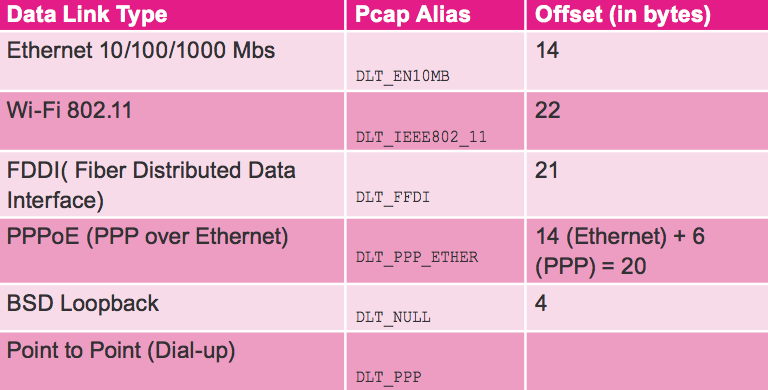
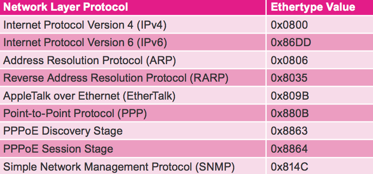
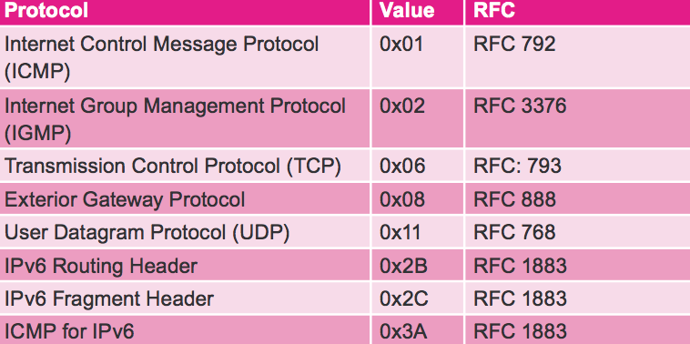

## pcap header

```
struct pcap_pkthdr {
	struct timeval ts;
	bpf_u_int32 caplen;
	bpf_u_int32 len;
}
struct timeval {
	long tv_sec;/*seconds*/
	long tv_usec;/*microseconds*/
}
```

## ethernet header (14)

```
typedef struct _eth_hdr {
	unsigned char dstmac[6];
	unsigned char srcmac[6];
	unsigned short eth_type;
}
```

数据链路层类型：



## ip header (20)

```
typedef struct _ip_hdr  
{  
    #if LITTLE_ENDIAN  
    unsigned char ihl:4;     //首部长度  
    unsigned char version:4, //版本   
    #else  
    unsigned char version:4, //版本  
    unsigned char ihl:4;     //首部长度  
    #endif  
    unsigned char tos;       //服务类型  
    unsigned short tot_len;  //总长度  
    unsigned short id;       //标志  
    unsigned short frag_off; //分片偏移  
    unsigned char ttl;       //生存时间  
    unsigned char protocol;  //协议  
    unsigned short chk_sum;  //检验和  
    struct in_addr srcaddr;  //源IP地址  
    struct in_addr dstaddr;  //目的IP地址  
}ip_hdr;
```

网络层协议类型值：




## tcp header (20)

```
typedef struct _tcp_hdr  
{  
    unsigned short src_port;    //源端口号  
    unsigned short dst_port;    //目的端口号  
    unsigned int seq_no;        //序列号  
    unsigned int ack_no;        //确认号  
    #if LITTLE_ENDIAN  
    unsigned char reserved_1:4; //保留6位中的4位首部长度  
    unsigned char thl:4;        //tcp头部长度  
    unsigned char flag:6;       //6位标志  
    unsigned char reseverd_2:2; //保留6位中的2位  
    #else  
    unsigned char thl:4;        //tcp头部长度  
    unsigned char reserved_1:4; //保留6位中的4位首部长度  
    unsigned char reseverd_2:2; //保留6位中的2位  
    unsigned char flag:6;       //6位标志   
    #endif  
    unsigned short wnd_size;    //16位窗口大小  
    unsigned short chk_sum;     //16位TCP检验和  
    unsigned short urgt_p;      //16为紧急指针  
}tcp_hdr;
```

传输层协议：




## 参考
- [TCP/IP/UDP/ICMP/ARP/ethernet 各种协议头部结构体](http://blog.csdn.net/xiexievv/article/details/45225921)
- [Programming with Libpcap](http://recursos.aldabaknocking.com/libpcapHakin9LuisMartinGarcia.pdf)


