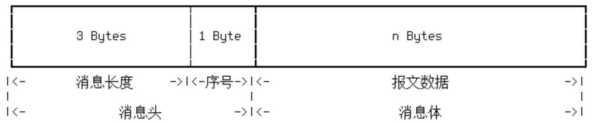

## MySQL报文结构
报文分为消息头和消息体两个部分，其中消息头占用固定的4个字节，消息体长度由消息头中的长度字段决定，报文结构如下：

- 消息头
报文长度用于标记当前请求消息的实际数据长度，以字节为单位，占用3个字节，最大值为0xFFFFFF，即接近16M（比16M小1）。

在一次完整的请求、响应交互过程中，用于保证消息顺序的正确性，每次客户端发起请求时，需要值都会从0开始计算。

- 消息体
消息体用于存放请求的内容以响应的数据，长度由消息头中的长度决定。

## 参考
- [MySQL协议分析](http://blog.csdn.net/wind520/article/details/43964821)
