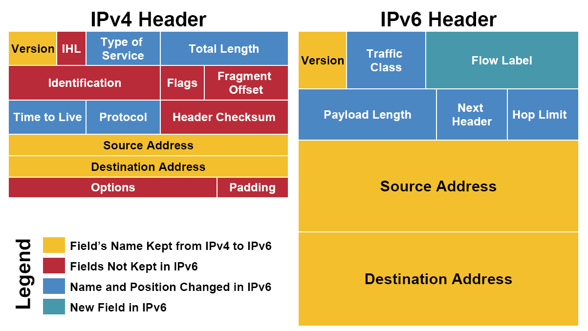

## IP包格式



- 黄色区域 
是IPv4和IPv6协议中都有的区域。

<font color="#FFBF00">Version</font>
用来表示IP协议的版本，占用4个字节（IPv4, Version=0100 ; IPv6, Version=0110）。

<font color="#FFBF00">Source Address/Destination Address</font>
分别为原地址和目的地址。

- 蓝色区域
是IPv4和IPv6协议中功能不变，名字有所变动的区域。

<font color="#2E2EFE">Type of Service（Hop Limit in IPv6）</font>
最初用来给IP数据包划分优先级的，比如语音通话需要实时性，所以它的IP包应该比Web服务的IP包具有更高的优先级。然而，这个最初不错的想法并没有被微软采纳。在Windows下生成的IP包都是具有相同优先级的，所以在当时造成Linux和Windows混合网络中，Linux的IP传输会慢于Windows。后来，该区域被实际分为两部分：<font color="#2E2EFE">Differentiated Service Field</font>（DS，前六位）和<font color="#2E2EFE">Explicit Congestion Notification</font>（ECN，后2位），前者依然用来区分服务类型，而后者用于表名IP包途径路由的交通状况。IPv6的Traffic Class也被如此分成两部分。通过IP包提供不同服务的想法，并针对服务进行不同的优化的想法已经很久了，但具体做法并没有形成公认的协议。比如ECN区域，其用来表示IP包经过路径的交通状况。如果接受者收到的ECN区域显示路径上很拥堵，他们接受者应该做出调整。但是实际上，许多接收者都会忽视ECN所包含的信息。交通状况的控制往往由更高层的比如TCP协议实现。

<font color="#2E2EFE">Total Length</font>
其和IPv6中的Payload Length的讨论将和IHL区域放在一起。

<font color="#2E2EFE">Time to Live（Hop Limit in IPv6）</font>
存活时间，最初表示一个IP包最初是表示一个IP包的最大存活时间：如果IP包在传输过程中超过Time to Live，那么IP包就作废。后来，IPv4的这个区域记录一个整数（例如30），表示在IP包解离过程中最多经历过30个路由接力，如果超过30个路由接力，那么这个IP包就作废。IP包如果没经过一个路由器，路由器就会给Time to Live减少1。当一个路由器发现Time to Live为0时，就不再发送IP包。IPv6中的Hop Limit区域记录的也是最大路由接力数，与IPv4的功能相同。Time to Live/Hop Limit避免了IP包在互联网中无限接力。也可以表示该网络包的衰减机制。

<font color="#2E2EFE">Protocol（Next Header in IPv6）</font>
用来说明IP包Payload部分所遵守的协议，也就是IP包之上的协议是什么。它说明了IP包封装的是一个怎样的高层协议（TCP/UDP）。

- 红色区域（IPv6中删除的区域）
<font color="#DF0101">IHL</font>
Internet Header Length用来记录头部总长度，Total Length则记录的是整个IP包的长度。由于IPv6没有options，其头部固定长度为40types，所以IPv6并不需要IHL区域。

<font color="#DF0101">Identification/Flags/Fragment Offset</font>
这三个都是为碎片化(fragmentation)服务的。碎片化是指一个路由器将接收到的IP包拆分成多个IP包传输，而接收这些碎片的路由器或是主机将碎片重组(reassembly)成一个IP包。不同的局域网所支持的最大传输单元（MTU，Maximum Transportation Unit）不同。如果一个IP包的大小超过了局域网支持的MTU，就需要在进入该局域网时碎片化传输。碎片化会给路由器和网络带来很大的负担。最好在IP包触发之前探测整个路径上的最小MTU，IP包的大小不超过该最小MTU，就可以避免碎片化。IPv6在设计上避免了碎片化，每个IPv6局域网的MTU都必须大于等于1280types，IPv6的默认发送IP包大小是1280types。

<font color="#DF0101">Header Checksum</font>
用来校验IP头部信息。IPv6中是没有这个区域的，其校验依赖于高层协议来完成，这样的好处是避免了执行checksum校验所需要的时间，减少了网络延迟（latency）。


<font color="#DF0101">options</font>
在IPv4头部最后，具有32位，是选填性质的区域。IPv4头部完全可以没有options区域，不考虑options区域，则IPv4头部20bytes，而具有了options区域，因此IPv4头部的长度是可变的，所以使用IHL来标记头部总长度。

- 绿色区域（IPv6新增区域）
<font color="#088A29">Flow Label</font>
器用来提醒路由器来重复使用之前的接力路径。这样IP包可以自动保持出发时的顺序。这对于流媒体之类的应用有帮助。

## IP协议特点
IP协议保证尽力传输（best effort）。在IP数据包传输过程中出现错误（例如checksum对不上、比如网络繁忙、比如超过Time to Live），根据IP协议，该数据包会直接丢弃，并非进一步进行错误修正。Best effort让IP协议保持很简单的形态，更多的质量控制交给高层协议处理，IP层协议只负责有效数据传输。

初次之外，IP协议也不高正IP包到达的先后顺序，这类似于多车道的公路，每辆车都在不停的变换车道。及时IPv6中的Flow Label字段可以建议路由器将一些IP包保持一样的接力路径，但这只是建议而已。

## Header Checksum算法
Header Checksum区域有16位。它是这样获得的，从header取的除checksum之外的0/1序列，按照十六位（也就是4位hex）分隔整个序列。将分割后的各个4位hex累加。如果超过16位的仅为出现，则将仅为加到后16位结果的最后一位。

例如，header（除去checksum）为：

```
9194 8073 0000 4000 4011 C0A8 0001 C0A8 00C7

  Binary                   Hex
  1001000110010100         9194
+ 1000000001110011         8073
------------------
1 0001001000000111        11207
+                1
------------------
  0001001000001000          1208
```

上述的计算方法就叫做one\'s complement sum。求得的所有十六位的和，

```
one\'s complement sum(4500, 0073, 0000, 4000, 4011, C0A8, 0001, C0A8, 00C7) = 1433
```

然后将1433的每一位取反（0->1, 1->0）,就得到checksum: EBCC。

这样，header就是：

```
9194 8073 0000 4000 4011 EBCC C0A8 0001 C0A8 00C7
```

IP包的接收方在接收到IP包之后，可以求上面各个16位数的one\' s complement sum，应该得到FFFF。如果不是FFFF，那么header是不正确的，整个IP包会被丢弃。


## 参考
-[我尽力——ip协议](https://www.cnblogs.com/vamei/archive/2012/12/02/2796988.html)
