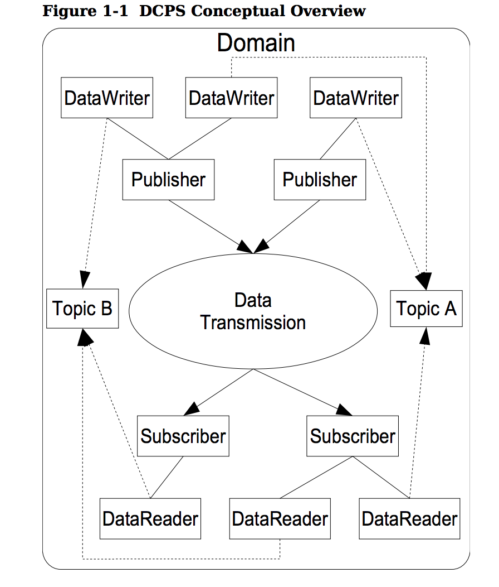

OpenDDS是对OMG数据分发服务（DDS）的开源实现，其主要应用于实时系统和试试发布订阅传输中。DDS定义了应用于分布式应用之间的服务，该服务不是CORBA特有的。规范提供了平台无关模型（PIM）和平台相关模型（PSM），可以将PIM映射为CORBA IDL的实现。

## DCPS 综述
本章节介绍了主要概念以及DCPS层的实体以及讨论实体之间是如何交互协同的。

- 基本概念

DCPS（以数据为中心的发布订阅）层如下图所示，后续章节会依次介绍该图中的各个概念。

<b>Domain</b>

domain在DCPS中是一个基本的分隔单元。每一个entities属于一个domain，且只能同同一个domain中的其他entities进行交互。应用程序代码可以自由的与多个domain交互，但是必须通过独立的属于不同domain的entities。

<b>DomainParticipant</b>

domain participant是某个domain中应用程序交互的入口点。对于许多涉及读写数据的对象domain participant是一个工厂。

<b>Topic</b>

topic是发布和订阅应用之间交互的基本手段。每个topic在其domain中都是唯一的并且指定数据类型。每个topic的数据类型根据其键值可以指定0或是更多的fields。当发布数据时，发布过程总是指定主题。订阅者通过topic请求数据。在DCPS概念中你可以向不同实例使用同一主题发布不同的数据样本。每个实例与键的唯一值相关联。一个发布过程在相同的实例上通过相同的键值发布多个数据样本。

## 参考
- [OpenDDS 开发手册-1章](http://download.objectcomputing.com/OpenDDS/OpenDDS-latest.pdf)
