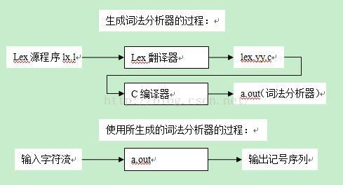

Lex是由美国Bell实验室M.Lesk等人用C语言开发的一种词法分析自动生成工具，其提供一种供开发者编写词法规则（正规式）的语言（Lex语言）以及这种语言的翻译器（这种翻译器将Lex语言编写的规则翻译成C语言程序）。

## Lex的基本原理和使用方法
Lex的基本工作原理为：由正规式生成NFA，将NFA变换成DFA，DFA经过简化后，模拟生成词法分析器。

其中正规式由开发者使用Lex语言编写，其余部分由Lex翻译器完成。翻译器将Lex源程序翻译成一个名为lex.yy.c的C语言源文件，该文件含有两部分内容：一部分是根据正规式构造的DFA状态转移表，另一部分是用来驱动该表的总控程序yylex()。当主程序需要从输入字符流中识别一个记号时，只需要调用一次yylex()就可以了。为了使用Lex所生成的词法分析器，我们需要将lex.yy.c程序用C编译器进行编译，并将相关支持库函数连如目标代码。Lex的使用步骤如下图所示：



## Lex源程序的写法
Lex源程序必须按照Lex语言的规范编写，其核心是一组词法规则（正规式）。一般而言，一个Lex源程序分为三部分，三部分之间以符号%%进行分隔。

```
[第一部分: 定义段]
%%
第二部分: 词法规则段
[%%
第三部分: 辅助函数段]
```

其中，第一部分以及第三部分和第三部分之上的%%都可以省略，即上述方括号阔气的部分可以省略。以%开头的符号和关键字，或者是词法规则端的各个规则一般顶着行首来写，前面没有空格。

Lex源程序中可以后注释，注释由/**/包围，但是注意，注释的行首要有前道空白。

- 第一部定义段写法

定义段可以分为两部分：

第一部分以符号%{  %}包裹，里面为C语法写的一些定义和声明。例如：文件包含、宏定义、常数定义、全局变量、外部变量定义、函数声明等。这一部分会被Lex翻译器处理后全部拷贝到文件lex.yy.c中。注意，特殊符号%{  %}都必须顶着行首写。例如：

```
%{
#define LT 1
int yylval;
%}
```

第二部分是一组正规定义和状态定义。正规定义是为了简化后面的词法规则而给部分正规式定义了名字。每条正规定义也要顶着行首写。例如下面这组正规定义分别定义了letter, digit和id所表示的正规式：

```
letter [A-Za-z]
digit [0-9]
id {letter}({letter}|{digit})*
```

注意：上面正规定义中出现的小括号表示分组，而不是被匹配的字符。而大括号括起来的部分表示正规定义名。

状态定义也叫做环境定义，它定义了匹配正规式时所处的状态名字。状态定义以%s开始， 后面跟所定义的状态的名字，注意%s也要顶着行首写。例如下面一行定义了一个名为COMMENT的状态和一个名为BAD的状态，状态名之间用空白分隔：

```
%s COMMENT BAD
```

- 第二部分词法规则段的写法

词法规则段列出的是词法分析器需要匹配的正规式，以及匹配该正规式后需要进行的相关动作。其例子如下： 

```
while {return (WHILE);}
do {return (DO);}
{id} {yylval = installID();return (ID);}
```

每一行都是一条规则，该规则的前一部分是正规式，需要顶行首写，后一部分是匹配该正规式后需要进行的动作，这个动作是C语言来写的，被包裹在{ }之中，被Lex翻译器翻译后会直接拷贝进lex.yy.c。正规式和语义动作之间要有空白隔开。其中用{ }包裹的正规式表示正规定义的名字。

也可以使用若干个正规式匹配同一条语义动作，此时正规式之间要用\|分隔。

- 第三部分辅助函数段

辅助函数段用C语言语法来写，辅助段一般是在词法规则段中用到的函数。这部分一般会被直接拷贝到lex.yy.c中。

- Lex源程序中词法规则（正规式）的相关规定

元字符： 元字符是lex语言中作为特殊用途的一些字符，包括：

```
* + ? | {} [] () . ^ $ " \ - / < > 。
```

正文字符：除了元字符意外的其他字符。这些字符在正规式中可以被匹配。若单个正文字符c作为正规式，则可与字符c匹配，元字符无法被匹配，如果元字符想要被匹配，需要进行转义，可使用""包住元字符或是在元字符前添加\ 。

部分元字符在lex语言中的特殊含义：

^表示补集： [^ ...]，即匹配除了^后所列出字符意外的任何字符。如[^0-9]表示匹配除数字字符0-9意外的任意字符。除^ - \ 以外，任何元字符在方括号内失去其特殊含义。如果要再方括号内表示符号-，则要将其至于方括号内的第一个字符位置或是最后一个字符位置，例如[-+0-9][+0-9-]都匹配数字及+-号。

.运算符，匹配除换行之外的任何字符，一般可作为一条翻译规则。

^匹配行首字符，如：^begin匹配出现在行首的begin。
$匹配行末字符，如: end$匹配出现在行末的end。

R1/R2 （R1和R2都是正规式）表示超前搜索：若要匹配R1，则必须先看紧跟其后的超前搜索部分是否与R2匹配。如：DO/{alnum}*={alnum}*，表示如果想匹配DO，则必须现在DO后面找到形式为：{alnum}*={alnum}的串，才能确定匹配DO。

- Lex源程序中常用到的变量及函数

yyin和yyout：这个是Lex中本身已经定义的输入和输出文件指针，这两个变量指明了lex生成的词法分析器从哪里获得输入和输出到哪里。默认：键盘输入，屏幕输出。

yytext和yyleng：这也是lex中已经定义的变量，直接使用就可以。

yytext：指向当前识别的词法单元（词文）的指针。

yyleng：当前词法单元的长度。

ECHO：Lex中定义的宏，可以出现在动作中，相当于fprintf(yyout, "%s", yytext);即输出当前匹配的词法单元。

yylex()：词法分析器驱动程序，用Lex翻译器生成的lex.yy.c内必然含有该函数。

yywrap()：词法分析器遇到文件结尾时会调用yywrap()来决定下一步怎么做。若返回1，则返回报告文件结尾的0标记。

由于词法分析器总是调用yywrap，因此辅助函数中最好提供yywrap，如果不提供，则在用C编译器编译lex.yy.c时需要连接相应的库，库中会给出标准的yywrap函数（标准函数返回1）。

- 词法分析器的状态（环境）

词法分析器在匹配正规式时，可以在不同的状态（或环境）下进行。我们可以规定在不同的状态下有不同的匹配方式。每个词法分析器至少有一个状态，这个状态叫初始状态。可以用INTIAL或0表示，如果还需要使用其他状态，可以在定义段使用%s定义。

使用状态时，可以用如下方式写词法规则：

```
<state1, state2> p0 {action0;}
<state1> pi {action1;}
```

这两行词法规则表示：在状态state1和state2下，匹配正规式p0后执行动作action0，而只有在状态state1下，才可以匹配正规式p1后执行动作action1。如果不指明状态，默认情况下处于初始状态INITIAL。

若想进入某个特定状态，可以在动作中这样：BEGIN state;执行这个动作后，就进入了状态state。

下面是一段处理C语言注释的例子，里面用到了状态转换，在这个例子中，使用不同的状态，可以让词法分析器处于注释中和注释外时使用不同的匹配规则：

```
%s c_comment

%%
<INITIAL>"/*" {BEGIN c_comment}
<c_comment>"*/" {BEGIN INITIAL}
<c_comment>. {;}
```

- Lex的匹配策略

1) 按最长匹配原则确定被选中的单词
2) 如果一个字符串能被若干正规式匹配，则先匹配排在前面的正规式

## Lex生成的词法分析器如何使用

lex常常与语法分析器生成工具yacc同时使用。此时，一般来说，语法分析器每次都调用一次yylex()获取一个记号。如果想自己写一个程序使用lex生成的词法分析器，则只需要再自己的程序中按需调用yylex()函数即可。

请注意：yylex()调用结束后，输入缓冲区并不会被重置，而是仍然停留在刚才读到的位置。词法分析器当前所处的状态（%s定义的那些状态）也不会改变。

## 编译方法

```
flex filename.l
gcc [-o outfile] lex.yy.c -lfl

gcc [-o outfile] lex.yy.c main.c -lfl
```


## 参考
- [Lex使用指南](https://www.cnblogs.com/wp5719/p/5528896.html)
