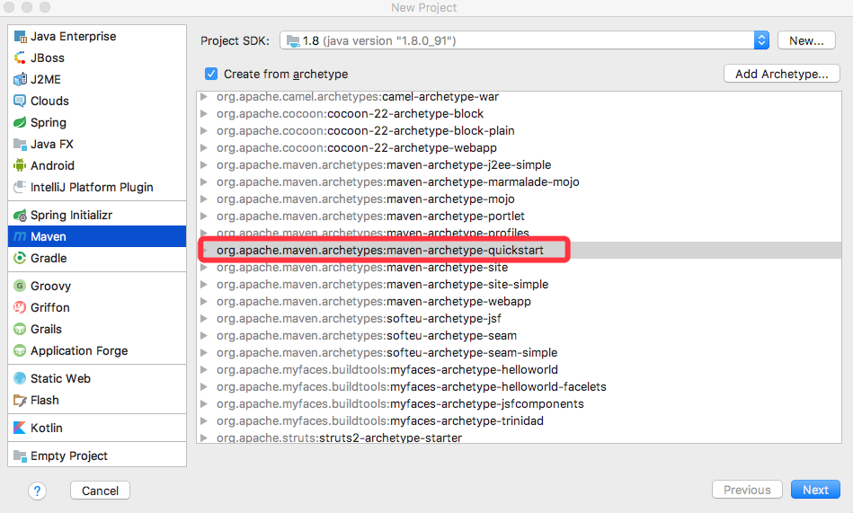
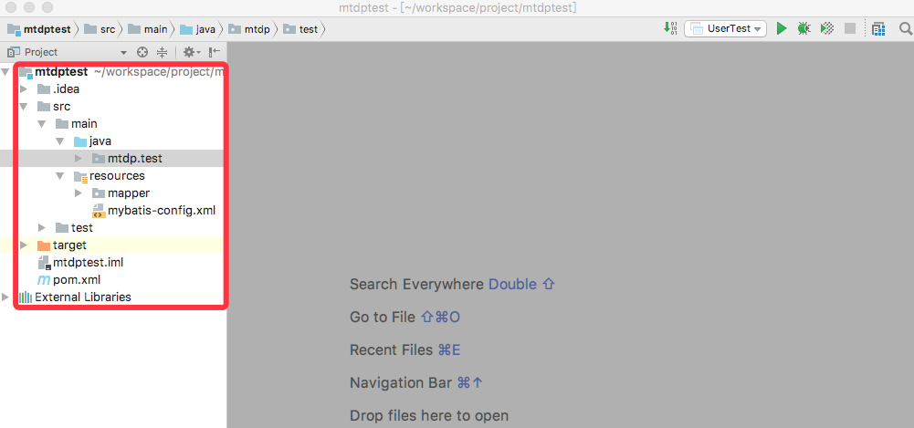

## 使用IntelliJ IDEA建立工程
- IntelliJ 注册码
[IntelliJ IDEA注册码](http://idea.lanyus.com/)

[IntelliJ Idea授权服务器使用](https://www.wrbug.com/2016/11/11/IntelliJ%20Idea%20%E6%8E%88%E6%9D%83%E6%9C%8D%E5%8A%A1%E5%99%A8%E4%BD%BF%E7%94%A8/)

- 建立工程





## 文件添加
- pom.xml添加依赖

```
  <!-- mybatis -->
    <dependency>
      <groupId>org.mybatis</groupId>
      <artifactId>mybatis</artifactId>
      <version>3.2.3</version>
    </dependency>

    <!-- mysql driver -->
    <dependency>
      <groupId>mysql</groupId>
      <artifactId>mysql-connector-java</artifactId>
      <version>5.1.20</version>
    </dependency>

    <!-- log -->
    <dependency>
      <groupId>log4j</groupId>
      <artifactId>log4j</artifactId>
      <version>1.2.16</version>
    </dependency>

    <dependency>
      <groupId>org.slf4j</groupId>
      <artifactId>slf4j-api</artifactId>
      <version>1.7.5</version>
    </dependency>
```

- resources/mybatis-config.xml

```
<?xml version="1.0" encoding="UTF-8" ?>

<!DOCTYPE configuration PUBLIC "-//mybatis.org//DTD Config 3.0//EN"
        "http://mybatis.org/dtd/mybatis-3-config.dtd">

<configuration>
    
    <typeAliases>
        <typeAlias type="mtdp.test.User" alias="User"></typeAlias>
    </typeAliases>

    <!-- 事务的管理和连接池的配置 -->
    <environments default="development">
        <environment id="development">
            <transactionManager type="JDBC" />
            <dataSource type="POOLED">
                <property name="driver" value="com.mysql.jdbc.Driver"/>
                <property name="url" value="jdbc:mysql://1.1.1.1:3306/user"/>
                <property name="username" value="user"/>
                <property name="password" value="u guess"/>
            </dataSource>
        </environment>
    </environments>

    <mappers>
        <mapper resource="mapper/User.xml"/>
    </mappers>

</configuration>
```

- mtdp.test/User.java

```
ckage mtdp.test;

/**
 * Created by atlas on 2017/11/29.
 */
public class User {
    private int id;
    private String name;
    private int age;

    public int getId(){return id;}
    public void setId() {this.id = id;}

    public int getAge() {return age;}
    public void setAge(int age) {this.age = age;}

    public String getName() {return name;}
    public void setName(String name) {this.name = name;}
}
```

- resources/mapper/User.xml

```
<?xml version="1.0" encoding="UTF-8" ?>
<!DOCTYPE mapper PUBLIC "-//mybatis.org//DTD Mapper 3.0//EN"
            "http://mybatis.org/dtd/mybatis-3-mapper.dtd">

<mapper namespace="com.mybatis3.mappers.User">
    <select id="select" parameterType="int" resultType="User">
        SELECT * FROM User WHERE id=#{id}
    </select>

    <insert id="insert" parameterType="User" useGeneratedKeys="true" keyProperty="id">
        INSERT INTO User (age, name) values (#{age}, #{name});
    </insert>
</mapper>
```

- mtdp.test.UserTest.java

```
package mtdp.test;

import org.apache.ibatis.io.Resources;
import org.apache.ibatis.session.*;

import java.io.IOException;
import java.io.Reader;
import java.sql.Connection;

/**
 * Created by atlas on 2017/11/29.
 */
public class UserTest {
    public static void main(String[] args) throws IOException {
        String resource = "mybatis-config.xml";
        Reader reader = null;

        reader = Resources.getResourceAsReader(resource);

        SqlSessionFactory sqlMapper = new SqlSessionFactoryBuilder().build(reader);
        SqlSession session = sqlMapper.openSession();

        //User user = session.selectOne("insert", 2);

        User user = new User();
        user.setAge(18);
        user.setName("ght");
        session.insert("insert", user);

        session.commit();

        System.out.println(user.getId());

        session.close();
    }
}
```

## 参考
-[Intellij Mybatis连接Mysql数据库](http://blog.csdn.net/qq_23195583/article/details/52792199) 


