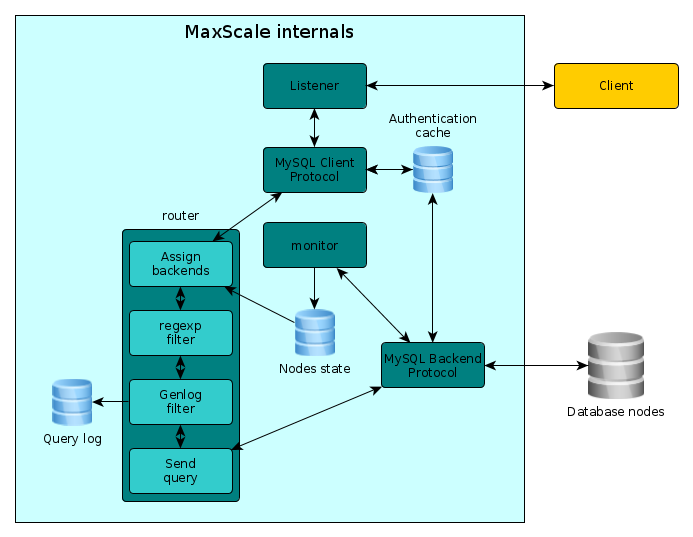

## 正文
自从MySQL支持复制开始，人们希望有一种好的方法来进行读写的自动分离，将写请求发送到主库，并且读请求在从库上进行负载均衡。然而开始时人们认为这很容易解决，实际上相当复杂。

首先，工具应当能够正确的解析和分析MySQL支持的所有形式的SQL，从而能够识别读写，有时候这并非像看上去一样容易。其次，需要考虑会话是否是在事务中。

当在事务中时，Innodb默认的隔离级别是可重复读，MVCC框架确保在事务的这段时间可以获得一致性的视图。这就意味着在事务中的所有语句必须在主库上执行，但是当事务提交或是回滚后，在同一个会话中的后续select语句会再次在从库上负载均衡。如果会话是自动提交模式的话也一样。

那么在会话中设置变量会是怎样呢？是否应该将这些会话连接到主库或是在从库上重新执行？如果要重新执行设置变量这些语句，需要将客户端连接同一组MySQL连接相关联，这组连接由至少一个主库和从库组成。那如何处理诸如“create temporary table... ?”的临时对象呢？当主从延迟或是复制断开如何进行处理呢？这些会是构建读写分离工具时需要面对的问题。

在过去的几年间，一些产品尝试解决读写分离的挑战。在我印象里MySQL_proxy是第一个尝试解决这个问题的，但是其有许多的限制。ScaleARC非常好用，但是仍旧有一些限制。最新的竞争者是MariaDB的MaxScale，这篇文章是我作为一个用户的实践之路。

首先对MaxScale做一个精准的介绍。MaxScale是一个开源项目，由MariaDB开发，目标是针对MySQL的模块化代理。MaxScale中的绝大多数功能都以模块化方法实现，这其中包括：MySQL协议、客户端和服务器端。

路由、监控和过滤也是模块化的。路由模块用来决定一条SQL发往哪里，读写分离路由实现了读写分离功能。读写分离路由使用嵌入式的MySQL服务器来解析查询...相当聪明并且查询解析相当强壮。

还有一些其他可用的路由组件，读连接路由是基于round-robin的负载均衡，并且支持权重，schema路由通过schema来对数据进行分割，binlog路由在管理大量从库的时候非常有用。

监控部分也是模块化的，用来维护后端MySQL服务器的信息。有Galera和NDB集群的复制设置监控器。最后，过滤模块可以深入软件栈来操纵查询和结果集。所有这些模块都具有良好的API定义，并且开发定制模块十分简单，甚至对于一个想我一样没什么开发经验的人，只需要最基本的C语言开发技能即可。在MaxScale中时间的处理使用了epoll，并且支持多线程。

过去的几个月我与一个客户一起工作，一起面对了一些挑战。在PXC集群上，有30k的QPS，这是由于他们的写模式以及避免认证的问题，他们希望写入到单一节点，并且读可以进行负载均衡。应用程序无法做到读写分离，如果没有工具做分离，只有一个节点将会承受所有的流量。当然，为了使问题简单，他们使用了大量的Java代码来设置大量会话级变量。此外，对于ISO 27001的兼容，他们希望记录所有的语句从而进行安全分析（与此同时进行性能分析）。因此，高查询率，读写分离和全SQL日志，确实是一个具有挑战的问题。

我们尝试了一些方法来尝试解决。其中一种解决方案是使用硬件负载均衡，可惜失败了，其实现过于简单，仅仅使用了正则表达式。另一个我们尝试的解决方案是使用ScalaArc，但是其需要为会话级别的变量设置大量的白名单规则，并且将这些规则重复应用到多个服务器上。ScaleArc几乎可以胜任，但是这些增长的规则会增加CPU的负载，增加每个CPU的消耗。语句会发送到rsyslog中并进行汇总来提供后续的分析。

最后，HA的实现是相当简洁的，我们对此有些问题。MaxScale到现在仍旧没有GA并且该项目十分年轻。虽然如此，我撰写了SQL日志过滤模块，将所有的查询发送到Kafka集群，我们进行了尝试。Kafka是一个记录大量SQL数据流的组件。实际上，30k QPS, 3个Kafka节点运行，每个CPU核心利用率都低于5%。虽然我们克服了一些问题，但要记住MaxScale仍旧很年轻，其显现除了解决问题的潜力并不断的向前演进。

在MariaDB,MaxScale后面的人员对我们遇到的问题十分敏感，我们最终达成了非常有用的一致性观点，并且在试用环境下测试是十分成功的。该解决方案已经部署到了预发布环境，并且如果一切顺利，其将会马上在生产环境上使用。下图是为客户配置的MaxScale的内部简化视图: 

图中的方框几乎都可以在配置文件中配置。我们使用了MySQL协议（客户端）定义了TCP监听器,其可以与读写分离路由或是读连接路由等路由进行连接。

路由一条SQL查询的第一步是设置backend。在该步骤中决定读写分离。同样，2个过滤器会被调用，regexp（可选）和Genlog过滤器。regexp过滤器可用于热补丁一个查询，Genlog过滤器是我们写的日志记录器。Genlog过滤器将会发送一个包含可以在MySQL generl query log 中能找到的内容的json字符串再加上执行时间。

权限认证也会记录日志，但是在上图中并没有标明。一个值得注意的点是，认证信息被MaxScale缓存并且当身份验证失败后刷新，刷新处理被限制来防止后端服务器过载。服务器是被持续监视的，间隔可以调整，当决定分配的backend后，服务器的状态被使用。

有关高可用，我写了一个简单MaxScale哨兵资源代理，其可以根据IPTable做负载均衡等一些使用。使用哨兵，我们有成熟的诸如quorum的解决方案以及我们可以依靠的防护装置。

性能方面十分优秀，在单核的虚拟环境下可以进行读写分离并且可以支持10K QPS 下降日志记录到Kafka中。虽然MaxScale支持多线程，我们仍旧使用每个进程中单线程模式，只是因为获得更高的吞吐量，并且自定义的邵明代理可以解决MaxScale实例集群的克隆。我们早期使用了MaxScale， 并且beta没有优雅的处理线程，因此我们构建了多个单实例。

由于需要一个总结，MaxScale被正式是一个实用且灵活的工具，其可以解决之前认为很难解决的一些问题。特别的，如果需要读写分离，可以尝试MaxScale，这是目前我找到的最好的额解决方案。保持联系，我会在将来写关于MaxScale的另一篇博客。

## 译文
- [MaxScale:A new tool to solve your MySQL scalability problems](https://www.percona.com/blog/2015/06/08/maxscale-a-new-tool-to-solve-your-mysql-scalability-problems/)
