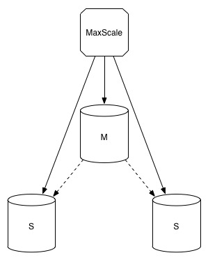
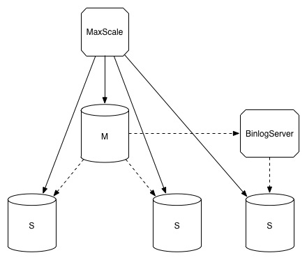
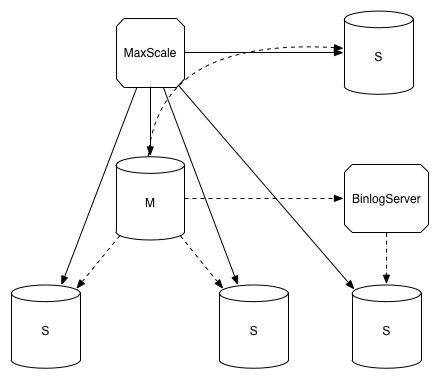

## 1 MaxScale作为proxy
- 机器规划
<table>
	<tr>
		<td>标识</td>
		<td>IP地址</td>
		<td>角色</td>
		<td>版本</td>
	</tr>
	<tr>
		<td>node1</td>
		<td>*.*.*.200</td>
		<td>MaxScale</td>
		<td>MaxScale 2.1.9</td>
	</tr>
	<tr>
		<td>node2</td>
		<td>*.*.*.14</td>
		<td>master</td>
		<td>percona-5.7.19-17</td>
	</tr>
	<tr>
		<td>node3</td>
		<td>*.*.*.182</td>
		<td>slave1</td>
		<td>percona-5.7.19-17</td>
	</tr>
	<tr>
		<td>node4</td>
		<td>*.*.*.192</td>
		<td>slave2</td>
		<td>percona-5.7.19-17</td>
	</tr>
</table>

- 部署图



- MaxScale配置

```
[maxscale]
threads=auto
syslog=1

log_warning=1
log_notice=1
log_info=1
log_debug=0

log_augmentation=1

basedir=/usr/local/maxscale/
logdir=/u01/maxscale/logs/trace/
datadir=/u01/maxscale/data/
cachedir=/u01/maxscale/cache/
piddir=/u01/maxscale/tmp/

[server1]
type=server
address=*.*.*.14
port=3306
protocol=MySQLBackend

[server2]
type=server
address=*.*.*.182
port=3306
protocol=MySQLBackend

[server3]
type=server
address=*.*.*.192
port=3306
protocol=MySQLBackend

[MySQL Monitor]
type=monitor
module=mysqlmon
servers=server1,server2,server3
user=test
passwd=pwd
monitor_interval=10000

[Read-Only Service]
type=service
router=readconnroute
servers=server2,server3
user=test
passwd=pwd
router_options=slave

[Read-Write Service]
type=service
router=readwritesplit
servers=server1,server2,server3
user=test
passwd=pwd

[MaxAdmin Service]
type=service
router=cli

[Read-Only Listener]
type=listener
service=Read-Only Service
protocol=MySQLClient
port=4008

[Read-Write Listener]
type=listener
service=Read-Write Service
protocol=MySQLClient
port=4006

[MaxAdmin Listener]
type=listener
service=MaxAdmin Service
protocol=maxscaled
socket=/u01/maxscale/tmp/maxadmin.sock
port=6603
```

- 启动

```
/usr/bin/maxscale -f /etc/maxscale.cnf
```

- admin

```
/usr/bin/maxadmin -S /u01/maxscale/tmp/maxadmin.sock
list servers
list services
```

- proxy

```
mysql -utest -p -hXXX -P4006
mysql -utest -p -hXXX -P4008
```

## 2 MaxScale作为Binlog Server

- 机器规划

<table>
	<tr>
		<td>node5</td>
		<td>*.*.*.226</td>
		<td>Binlog Server</td>
		<td>MaxScale 2.1.9</td>
	</tr>
	<tr>
		<td>node6</td>
		<td>*.*.*.151</td>
		<td>sub-slave</td>
		<td>percona-5.7.19-17</td>
	</tr>
</table>

- 部署图



- MaxScale配置

```
cat /etc/maxscale.cnf

[maxscale]
threads=auto
syslog=1
maxlog=1
log_warning=1
log_notice=1
log_info=1
log_debug=0
log_augmentation=1

basedir=/usr/local/maxscale/
logdir=/u01/maxscale/logs/trace/
datadir=/u01/maxscale/data/
cachedir=/u01/maxscale/cache/
piddir=/u01/maxscale/tmp/

[Replication]
type=service
router=binlogrouter
version_string=5.7.19-17

router_options=server_id=1024, heartbeat=30, send_slave_heartbeat=1
binlogdir=/data/binlog
user=test
passwd=pwd

[ReplicationListener]
type=listener
service=Replication
protocol=MySQLClient
port=5308

[MaxAdmin Listener]
type=listener
service=MaxAdmin Service
protocol=maxscaled
socket=/u01/maxscale/tmp/maxadmin.sock
port=6603

[MaxAdmin Service]
type=service
router=cli
```

```
cat /data/binlog/master.ini
[binlog_configuration]
master_host=*.*.*.14
master_port=3306
master_user=repl
master_password=pwd
filestem=mysql-bin
```

- 启动

```
/usr/bin/maxscale -f /etc/maxscale.cnf
```

- BinlogServer

```
mysql -utest -p  -h*.*.*.226 -P5308
show master status;
show slave status\G
```

## 3 MaxScale作为proxy & Binlog Server

- 机器规划

<table>
	<tr>
		<td>node1</td>
		<td>*.*.*.226</td>
		<td>proxy & Binlog Server</td>
		<td>MaxScale 2.1.9</td>
	</tr>
	<tr>
		<td>node7</td>
		<td>*.*.*.7</td>
		<td>sub-slave</td>
		<td>percona-5.7.19-17</td>
	</tr>
</table>

- 部署图



- MaxScale配置

```
cat /etc/maxscale.cnf

[Replication]
type=service
router=binlogrouter
version_string=5.7.19-17

router_options=server_id=1024, heartbeat=30, send_slave_heartbeat=1
binlogdir=/data/binlog
user=test
passwd=pwd

[ReplicationListener]
type=listener
service=Replication
protocol=MySQLClient
port=5308
```

```
cat /data/binlog/master.ini
[binlog_configuration]
master_host=*.*.*.14
master_port=3306
master_user=repl
master_password=pwd
filestem=mysql-bin
```

- 启动

```
/usr/bin/maxscale -f /etc/maxscale.cnf
```

- BinlogServer

```
mysql -utest -p  -h*.*.*.226 -P5308
show master status;
show slave status\G
```

## 参考
- [MaxScale:A new tool to solve your MySQL scalability problems](https://www.percona.com/blog/2015/06/08/maxscale-a-new-tool-to-solve-your-mysql-scalability-problems/)
- [Maxscale-充当Binlog Server(4)](http://www.ttlsa.com/mysql/maxscale-became-binlog-server/)
- [Maxscale安装-读写分离(1)](http://www.ttlsa.com/mysql/maxscale-install-read-write-split/)
